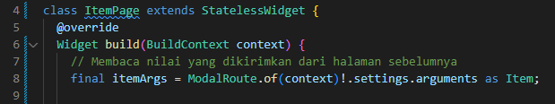

# belanja

A new Flutter project.

## Getting Started

# Praktikum 5

Langkah 1: Siapkan Project Baru

Langkah 2: Mendefinisikan Route

- Membuat file baru dengan nama home_page.dart dan item_page.dart

- Deklarasikan class HomePage dan ItemPage pada masing-masing file

Langkah 3: Lengkapi Kode main.dart

Langkah 4: Membuat Data Model

Langkah 5: Lengkapi kode di class HomePage

Langkah 6: Membuat ListView dan itemBuilder

Langkah 7: Menambahkan aksi pada ListView

- Sorot menu wrap with widget

- Ubah nilai widget menjadi InkWell

# Tugas Praktikum 2

1. Untuk melakukan pengiriman data ke halaman berikutnya, cukup menambahkan informasi arguments pada penggunaan Navigator.

2. Pembacaan nilai yang dikirimkan pada halaman sebelumnya dapat dilakukan menggunakan ModalRoute. Tambahkan kode berikut pada blok fungsi build dalam halaman ItemPage. Setelah nilai didapatkan, anda dapat menggunakannya seperti penggunaan variabel pada umumnya.

3. Pada hasil akhir dari aplikasi belanja yang telah anda selesaikan, tambahkan atribut foto produk, stok, dan rating. Ubahlah tampilan menjadi GridView seperti di aplikasi marketplace pada umumnya.

- item.dart

- home_page.dart

- item_page.dart

4. Silahkan implementasikan Hero widget pada aplikasi belanja Anda

- main.dart

- home_page.dart

- item_page.dart

5. Tambahkan Nama dan NIM di footer aplikasi belanja Anda.

- home_page.dart

- item_page.dart

# Hasil Aplikasi

- home_page.dart

-item_page.dart

This project is a starting point for a Flutter application.

A few resources to get you started if this is your first Flutter project:

- [Lab: Write your first Flutter app](https://docs.flutter.dev/get-started/codelab)
- [Cookbook: Useful Flutter samples](https://docs.flutter.dev/cookbook)

For help getting started with Flutter development, view the
[online documentation](https://docs.flutter.dev/), which offers tutorials,
samples, guidance on mobile development, and a full API reference.
